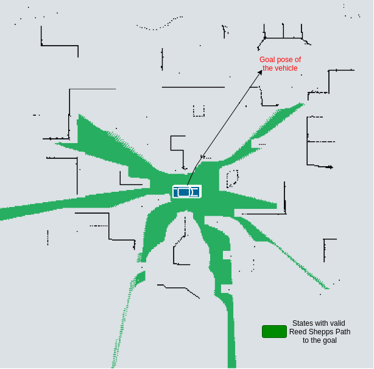

My major interest lies in the field of Motion Planning and Control of autonomous bots. Some other fields of interest are Computer Vision and Deep Learning.  

Most of my research work has been in the field of Search Based motion planning as I have been a part of [Search Based Planning Laboratory](https://www.ri.cmu.edu/robotics-groups/search-based-planning-laboratory/) at CMU for the past year.

Some of my research Projects and Publication are

## **[Learning to Use Adaptive Motion Primitves in Search-Based Motion Planning](research/iros_2020/iros_2020.md)**

This work was recently accepted for [International Conference on Intelligent Robots and Systems (IROS)](https://www.iros2020.org/) 2020 which will be held on October 25, 2020. 

In this work we provide an algorithm that intelligently activates *Adaptive Motion Primitives* using Deep Learning for motion planning in navigation domain using Heuristic-based graph search algorithms like A* .Our experiments shows that our approach can lead to upto 2x speedup in planning times.

## **[Motion Planning for an Autonomous Airship]()**

